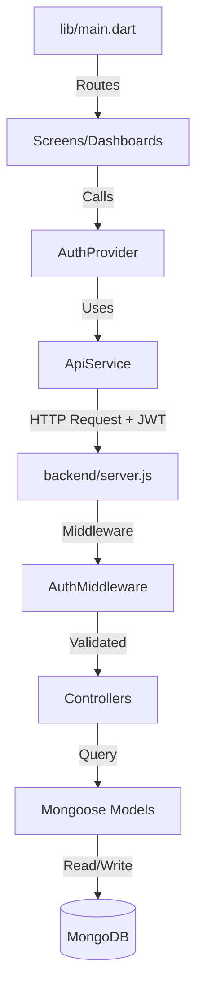

# ShopJS System Architecture & Code Flow

This document explains the technical journey of a request within the ShopJS Retail Management system, from the initial Flutter launch to the final database operation in MongoDB.

---

## 1. Frontend Entry Point (`lib/main.dart`)
- **Initialization**: The `main()` function is the starting point. It wraps the entire application in a `MultiProvider` to make `AuthProvider` available globally.
- **Routing Engine**: We use `GoRouter` for navigation. It has a **Redirect Logic** that checks if a user is logged in. 
  - If NOT logged in: Forces user to `/login`.
  - If logged in: Redirects them to their specific role-based dashboard (e.g., `/superadmin`, `/owner`).

## 2. State Management (`lib/providers/auth_provider.dart`)
- Acts as the "Brain" of the frontend.
- **Storage**: Uses `FlutterSecureStorage` to persist the JWT token across app restarts.
- **Functions**: Handles `login()`, `logout()`, and `checkAuthStatus()`. 
- When a login is successful, it notifies all listeners (screens) to rebuild and trigger the `GoRouter` redirect.

## 3. The API Bridge (`lib/services/api_service.dart`)
- Every network request goes through this service.
- **JWT Injection**: It automatically reads the token from secure storage and adds it to the `Authorization: Bearer <token>` header.
- **Abstraction**: Provides clean methods like `get()`, `post()`, `put()`, and `delete()` so screens don't have to handle raw HTTP headers or JSON encoding/decoding repeatedly.

## 4. Backend Entrance (`backend/server.js`)
- **Express Server**: The entry point for our Node.js environment.
- **Middleware**: 
  - `cors()`: Allows the Flutter app to communicate with the server.
  - `express.json()`: Parses incoming request bodies.
- **Deployment**: Routes are modularly registered (e.g., `/api/auth`, `/api/shops`, `/api/products`).

## 5. Security Layer (`backend/middleware/authMiddleware.js`)
- Before a request hits a controller, it passes through security checks:
  - **`verifyToken`**: Decodes the JWT to ensure the user is who they say they are.
  - **`requireRole`**: Checks if the user's role (e.g., `manager`) has permission to access that specific endpoint.

## 6. Business Logic (`backend/controllers/`)
- This is where the actual "work" happens.
- Example: `shopController.js` handles creating a shop. It doesn't just save a name; it also creates the first **Owner** user account simultaneously to ensure the shop isn't "orphaned."

## 7. Data Persistence (`backend/models/`)
- **Mongoose Schemas**: Defines the structural blueprint of our data (Users, Shops, Products).
- **MongoDB**: The final destination where data is stored.

---

### Summary Diagram

